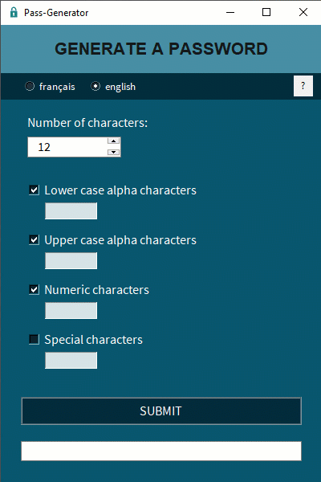

# pass-generator

[](https://fgainza.fr)

## exe application to generate a random password



### Features

- python code (pyinstaller to create the .exe)
- 🆕 Select the interface language (english or french)
- 🆕 Add a help page
- choice of the password length (between 3 and 50 characters)
- choice of the type of characters to use (lower case, upper case, numbers, special characters)
- 🆕 Specify a number, a minimum (like "2-"), a maximum (like "-8"), an intervall (like "2-8"), or nothing for each type of character
- automatic copy of the password on the clipboard when it is generated

### Installing

You can use directly the file 'pass-generator.exe' present in the folder '/app/' or generate by yourselves the executable.

To build by yourself :

- After cloning the repository:

```bash
    ### Navigate to the directory
    $ cd /navigate/repository/pass-generator
	
    ### Create a new environment
    $ python -m venv venv 
    ### Activate this environment
    $ venv\Scripts\activate.bat
    ### Run the requirements.txt
    $ pip install -r requirements.txt
	
    ### Create the .exe version
    $ pyinstaller --icon=exe.ico -F --noconsole pass-generator.py
```

Running requirements.txt will install the following modules:

- tkinter (it should be already installed with Python)
- pyperclip (to copy the generated password to the clipboard)
- pyinstaller (to generate the .exe)

### Authors

**Frédéric Gainza** _alias_ [@FredGainza](https://fgainza.fr)

## License

This project is licensed under the [MIT] License - see the LICENSE.md file for detail
